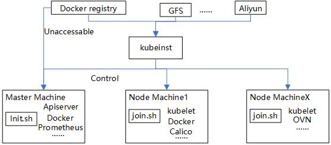

## kubeInstaller

Install Kubernetes-based systems with a simple and comprehensible way.
Now this script can only work in CentOS/RHEL 7.x with various CPU arch.

## 技术架构

Our installer is used in a shell - bare metal machine way. Its framework is shown as below:



our installer has several key points:

1. Due to network issues, many components can not be directly access by domestic machines, we solve it by kubeinst;
2. Due to different versions of Linux, it may encounter many conflicts during installation, and we support certain version of ubuntu 18.04 and Centos 7.4
3. We do not test them fully, some manual works need to be done when using the installer.

## 技术特色

We support a large range of installations:

| Name        | Type      | Version |  Packages  |   
| ------      | ------    | ------  | ------      |
| Docker      | Container-based virtualization | 19.03   | [redhat](https://docs.docker.com/install/linux/docker-ee/rhel/), [openSUSE/SUSE](https://docs.docker.com/install/linux/docker-ee/suse/), [centos](https://docs.docker.com/install/linux/docker-ce/centos/), [debian](https://docs.docker.com/install/linux/docker-ce/debian/), [fedora](https://docs.docker.com/install/linux/docker-ce/fedora/), [ubuntu](https://docs.docker.com/install/linux/docker-ce/ubuntu/) |
| Containerd  | Container-based virtualization | 1.3.9   |[Linux](https://containerd.io/docs/getting-started/)|
| Kubernetes  | Virtual compute resource pool  | 1.20.2  | [Linux](https://docs.kubernetes.io/) |
| Calico      | Network solution        | 3.17  | [Linux](https://docs.projectcalico.org/v3.17/getting-started/kubernetes/) |
| OVN         | Network solution        | 1.6.0 | [Linux](https://github.com/alauda/kube-ovn) |

## 代码结构

```
kubeinst: main install file
init.sh: initialize kubernetes master node.
join.sh: initialize kubernetes node node.
|jsons|*template|*.json: CRD resources from cloud providers.
|system|*.yaml: some pods may be useful when using kubernetes.
|pdos|configs|*.yaml: some settings controlling kubernetes tokens. 
```

## 部署方式

download the `kubeinst` tool.

```
curl --url https://raw.githubusercontent.com/kubesys/kubernetes-installer/master/kubeinst --output /usr/bin/kubeinst
chmod 777 /usr/bin/kubeinst
```

## 使用方式

```
kubeinst init-env
kubeinst init-kube
```

Now it support two commands

```
Commands:
  init-env       :	(Init): simplify configuring node, such as disable selinux, install docker
  init-kube      :	(Init): deploy Kubernetes as your want
```

- Using the `init-env` command, you can install Docker and Kubernetes on a just installed OS.
- Using the `init-kube` commnad, you can install kubernetes as your want

```
kubeinst init-env [containerd/docker]
kubeinst init-kube
```

Note that you can customized :

- /etc/kubernetes/kubeadm.yaml： how to install Kubernetes
- /etc/kubernetes/kubeenv.list: which plugins should be installed

## 使用说明

- Prototype
  - 0.1: support Kubernetes and Calico
  - 0.2: support prometheus, grafna
  - 0.3: support loki, register
- Develop

- Production

```
kubectl proxy --address=0.0.0.0 --port=31888 --accept-hosts=
39.106.40.190
```

```
kubectl taint nodes --all node-role.kubernetes.io/master-
```
